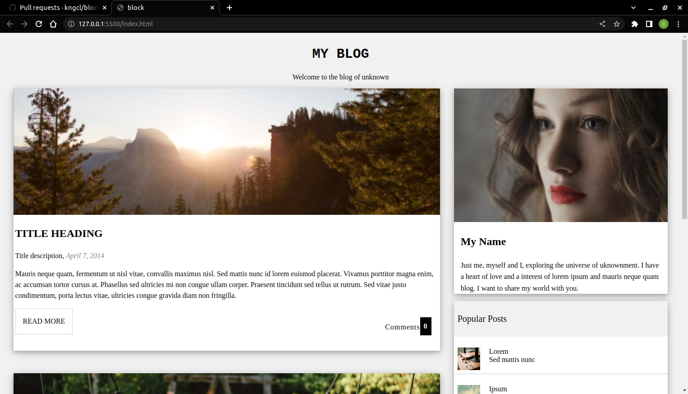

# Block project

Talks about the personality and observation of someone about a place in particular.
has two sections, right sections presenting the speaker and the left section presenting places

## App

### Built With

- HTML
- CSS

### Prerequisites

Knowledge about:

- HTML
- CSS
- Google chrome
  
## Clone project

- To get a local copy up and running follow these simple example steps.
- Clone this repository with `https://github.com/kngcl/block` using your terminal.
- Change to the project directory by entering: cd block in the terminal.

## steps

- $ git clone `https://github.com/kngcl/block`
- $ `cd block`
- $ `git checkout feature/footer`

## Start App

- run by opening the index.html in the browser

## Author

👤 **kngcl**

- GitHub: [@kngcl](https://github.com/kngcl/block)

## 📝 License

This project is [w3school](./LICENSE) licensed.
